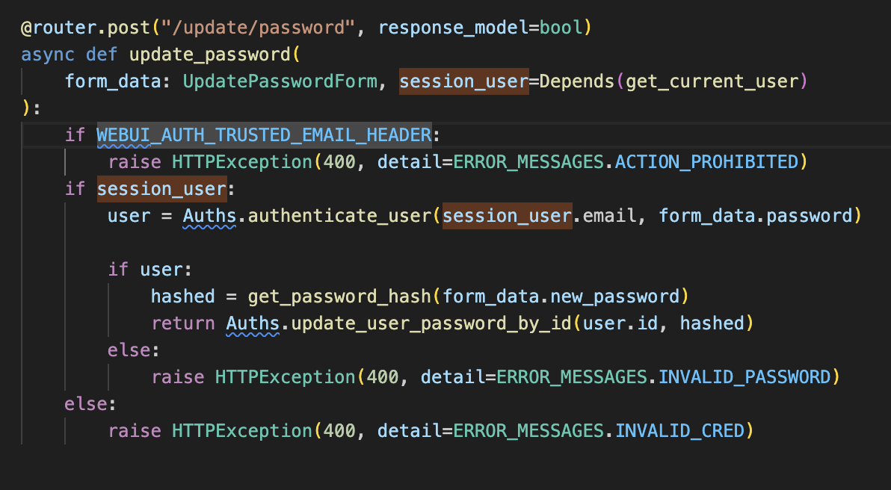
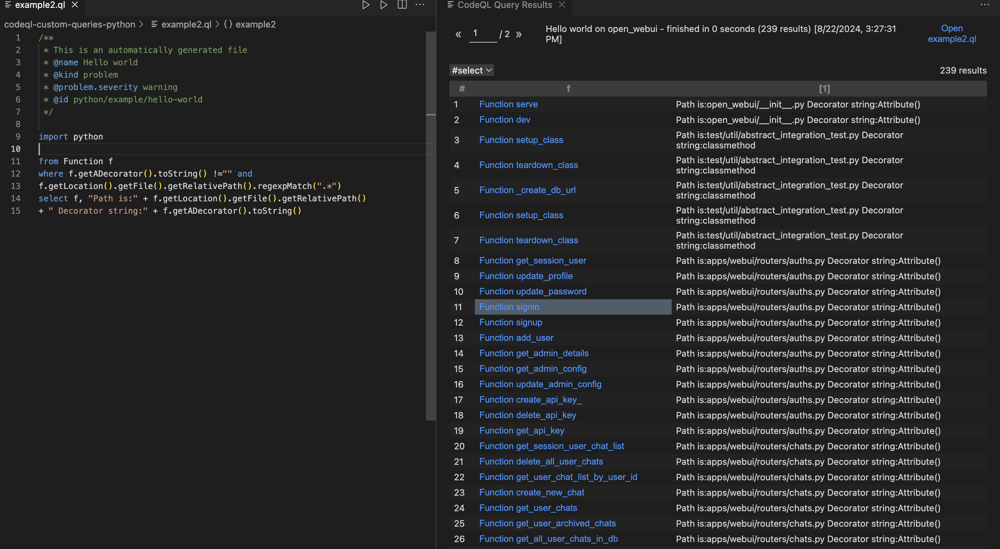
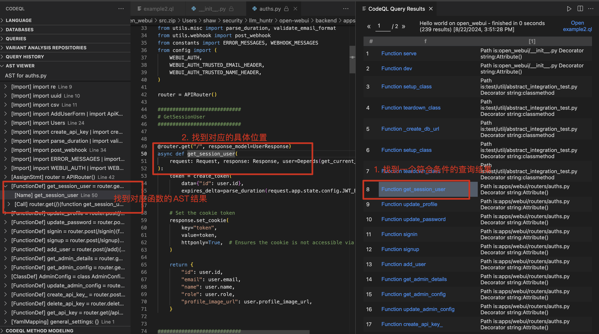
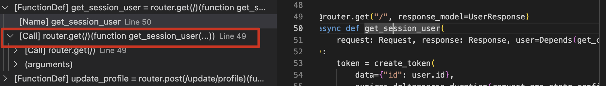
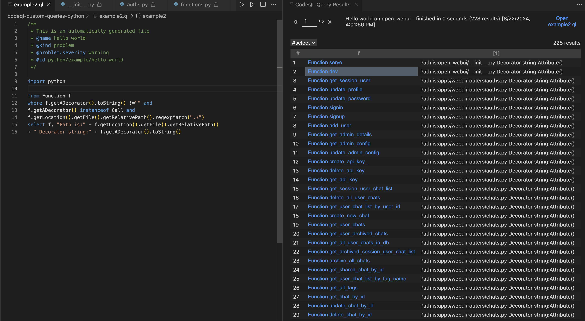
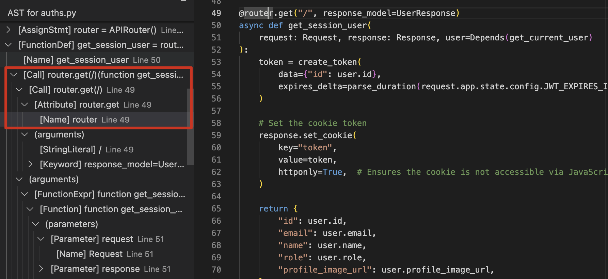
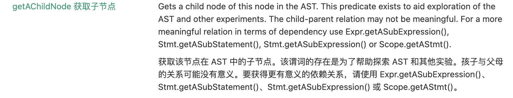
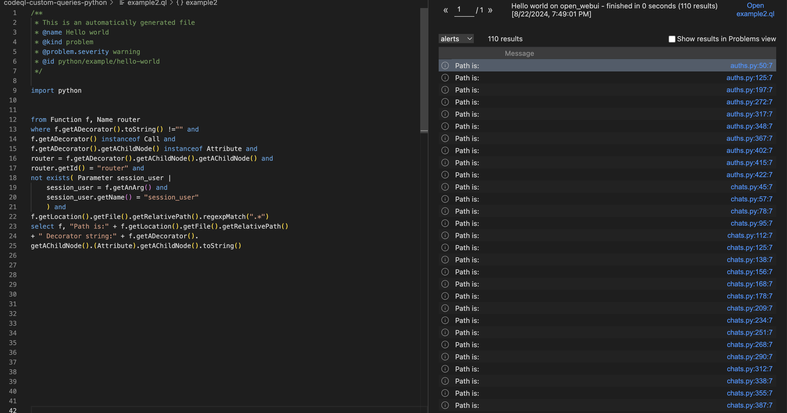
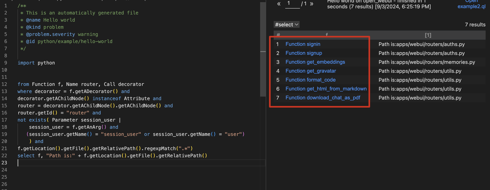

最近在学习 `Python`的 `Codeql`, 打算用来辅助得进行一些漏洞自动化挖掘。但是学习的过程非常痛苦，主要有以下两点原因：

1. 网上关于(Python)CodeQL的资料太少且大多数都是英文版的;

2. 关于Python相关的CodeQL文章基本都是Github的中文翻译版, 千遍一律，有些帮助,但真不多。

于是我总结、记录了下近期关于CodeQL Python的学习笔记，分享下学习过程中的思考，并通过一个案例希望帮助读者更好的理解。

> ⚠️注意：本文不属于小白教学，不会教您什么是CodeQL以及基础测试环境怎么搭建。如果你对 codeql一点都不了解，你可以退出这篇文章。

> 🫵为谁准备？ 如果你正处于CodeQL入门阶段，了解一些CodeQL基础但还不太能够写自己理想中的规则，那这篇文章正是为你而写。

## table of content

## 基础

**再次强调，本文不适用于没有CodeQL基础的读者，本文的写作目的是分享自己的学习经验，来帮助刚入门CodeQL的读者,如何编写出自己理想效果中的CodeQL规则。**

**刚入门的意思是：**

- **已经了解  Codeql 的基本概念**

- **已经配置好相关测试环境**

- **你已经了解 Codeql 的基础语法**

- **你不知道如何在基础语法的基础上实现自己想要查询效果**

在阅读本文之前，我希望读者带着这些问题(再次)阅读下面这篇文章, 或许对你会有新的理解：

1. 什么是AST

2. 什么是控制流

3. 什么是数据流

4. 什么是污点分析

5. 这几者之间的关系

[CodeQL zero to hero part 1: The fundamentals of static analysis for vulnerability research - The GitHub Blog](https://github.blog/developer-skills/github/codeql-zero-to-hero-part-1-the-fundamentals-of-static-analysis-for-vulnerability-research/)

### 我的答案

**AST**

AST是将源代码以树形式进行表示。**这有什么用？**

在CodeQL中，我的理解是可以把可以把AST当作**正则表达式**来使用。什么意思？比如我想找一个特定的函数 如 `eval()` , 这时候我就可以使用AST; 又或者, 如果你有经常使用 `grep("eval\(")`的经验,在CodeQL你完全可以使用AST去进行代替。

不过于正则不同之处在于， AST的定位更加准确和细腻,这表现在使用AST能够更灵活的匹配到:一个表达式、一个语句块、一个函数定义等等....

**控制流**

回想一下手动审计的过程, 倘若现在已经能定位到敏感函数了，下一步骤应该是什么？

答案是函数回溯，也就是去寻找函数的调用过程。

控制流的作用就是表示了程序的执行逻辑, 比如IF条件下不同布尔条件下，代码的不同执行逻辑。通过控制流能确定敏感函数的调用过程。

> Thanks to the control flow graph, we can track how the code flows throughout the program and perform further analysis.

**数据流**

通过AST 和 控制流， 现在已经能够将定位敏感函数，并理清楚函数的执行逻辑，执行分支，

现在的关键就是去确定敏感函数中的参数部分。

在代码审计审计中，有两个概念： source和slink。 其中，source表示程序的可控点，如在`PHP`中的常见全局变量 `$_GET`, `$_POST`, `$_REQUEST`是source, `Python Flask`中的`request.GET`是source。只要是程序从外部接受可控输入的地方都是source；slink表示漏洞触发点，常表现为执行相关的敏感函数，如`PHP` 的 `system()`, `eval()` ,`Java` 的 `Runtime.getRuntime().exec()`, `Python` 的 ` os.system()` 等等等。

而数据流所做的就是用于判断数据是否能从 souce成功到达 slink。

> we can utilize a control flow graph of the source code to check if there is a connection between a given source and a sink—a data flow. We call that technique “data flow analysis.”

**污点分析**

在追踪数据流的过程中，会经常出现如下的一种场景，以博客中的示例代码为例：会发现跟踪的 source 经过处理变成了另一个字符串，我们可控的source  `username`现在通过拼接传递到的了变量 `sql` , 这时候再追踪 `username` 已经没用任何意义，但是数据流分析不会跟踪到新出现的`sql` 。为了解决这个问题，出现了污点分析的概念。

> Taint tracking marks certain inputs—sources—as “tainted” (here, meaning unsafe, user-controlled), which allows a static analysis tool to check if a tainted, unsafe input propagates all the way to a defined spot in our application, such as the argument to a dangerous function.

```python
1. from django.db import connection
2.
3. def profile(request):
4.    with connection.cursor() as cursor:
5.        username = request.GET.get("username")
6.        sql = f"SELECT * FROM users WHERE username={username}"
7.        cursor.execute(sql)
```

## 重点

在了解了CodeQL中最关键的几个概念以及其联系后, 我根据自己的理解总结了一下一些重点：

**AST**

AST主要用于关键代码、函数或者表达式的查找和定位。 定位的意思是只能找到相应部分的代码，但不具备上下文分析。比如能通过AST定位到特定函数，但是并不能定位到传入这个函数的参数从哪里来， 因为参数从上往下的传递过程涉及到上下文。

能用正则的地方都能用AST。

**控制流**

和程序的执行顺序和执行逻辑有关的地方都可以使用控制流来进行处理。

 比如 `if`, `while`, `try...catch`等等...

**数据流**

涉及到数据的上下流动

**污点分析**

涉及到数据的上下传递

## 案例

接下来通过一个案例来实践感受下如何编写出自己理想中的规则, 案例中涉及到的项目地址为: https://github.com/open-webui/open-webui, 

起因：快速浏览一下代码,发现很多路由函数都要求` session_user1`参数, 猜测不携带`session_user` 参数的路由函数存在未授权访问；

目标：尝试使用`CodeQL` 查找到所有不含 `session_user` 参数的路由函数。



明确目标：

目标是去**查找**函数, 而并不是去查找漏洞。查找函数的意思类似于使用正则表达式**定位**我们需要的函数，因此这个过程只需要涉及到 **AST**。

我的思路如下：

1. 目标是个**函数**，

2. 这个函数使用了**装饰器**，

3. 这个装饰器是使用 `from fastapi import APIRouter` 实现。

4. 这个函数没有显示设置 `session_user` 参数。

### 1. 目标是个函数

目标是个函数，这个任务很好解决，使用标准库的 `Function` 即可找到项目中定义的函数：

```codeql
import python


from Function f
select f, "Found function:" f.toString()
```

### 2. 函数使用了装饰器

通过`VSCode`发现`Function.` 的谓词补全提示，找到了一个叫 `getADecorator()`的谓词, 完善一下语句，如下所示：

```codeql
from Function f
where f.getADecorator().toString() !="" and
f.getLocation().getFile().getRelativePath().regexpMatch(".*")
select f, "Path is:" + f.getLocation().getFile().getRelativePath() + " Decorator string:" + f.getADecorator().toString()
```

这里加了一个条件 ：`f.getLocation().getFile().getRelativePath().regexpMatch(".*")` ，作用是限制当前筛选条件仅限于当前项目，不然会出现 若没有在当前项目匹配到结果时，会匹配到其他一些地方的结果。

执行后可以看到查询结果如下图所示：



### 3. 查找满足条件的装饰器

目前已经找到了装饰器的函数，那如何去过滤不需要的部分呢？

这时候可以使用 `VSCode CodeQL`中的 `Ast Viewer`栏功能：





发现这个案例中存在一个Call，于是优化下查询语句：

```codeql
import python

from Function f
where f.getADecorator().toString() !="" and
f.getADecorator() instanceof Call and
f.getLocation().getFile().getRelativePath().regexpMatch(".*")
select f, "Path is:" + f.getLocation().getFile().getRelativePath() 
+ " Decorator string:" + f.getADecorator().toString()
```

> 如果不确定f.getADecorator()对应的CodeQL类型，可以使用 f.getADecorator().getAQlClass() 来判断.

查询结果如下：



虽然此时查询出来的大多数函数已经符合要求，但仍存在个别函数不满足，如查询结果的第一个值 `server` 和第二个值   `dev`。

因此还需要再对查询语句进行优化下，优化后的语句如下：

```codeql
import python

from Function f, Call c, Name router
where f.getADecorator().toString() !="" and
f.getADecorator() instanceof Call and
f.getADecorator().getAChildNode() instanceof Attribute and
router = f.getADecorator().getAChildNode().getAChildNode() and
router.getId() = "router" and
f.getLocation().getFile().getRelativePath().regexpMatch(".*")
select f, "Path is:" + f.getLocation().getFile().getRelativePath() 
+ " Decorator string:" + f.getADecorator().toString()
```

我是如何构造出下面这段优化语句的？

```codeql
f.getADecorator().getAChildNode() instanceof Attribute and
router = f.getADecorator().getAChildNode().getAChildNode() and
router.getId() = "router"
```



回到上面 `Ast Viewer` 中关于 `def get_session_user()` 这部分的语法树，可以看到一个层级的关系：

```codeql
[FunctionDef] get_session_user
--- [Name] get_session_user
--- [Call] router.get(/)(function get_session)
--- --- [Call] router.get(/)
--- --- --- [Attribute] router.get
--- --- --- --- [Name] router
--- --- (arguments)
```

`AST Viewer` 这个功能还是很有用的，比如我现在鼠标点一下`@router`，左边最自动用一个深色提示，告诉我 `router` 这段代码在AST树中的位置，这里的结果是 `[Name]`。

因此接下来想办法使用`CodeQL`定位到这个`Name`就可以了.

我通过 `getAchildNode` 这个谓词定位到`[Call] router.get(/)`的所有子节点，随后通过 `instanceof Attrbute` 筛选到 `[Attribute] router.get`, 再使用 `getAchildNode` 定位其(`[Attribute] router.get`)下面的子节点。由于此时子节点只存在`[Name] router`,所以我在拿到结果后并没有进行筛选, 当然在这里也可以和上一步一样使用 `instanceof Name` 来进行筛选。 此时已经定位到了 `[Name]` 这个结点, 需要通过判断其名称为 `router` 来进行筛选。

根据上述解释，最直接的`CodeQL`语句其实是长这样：

```codeql
import python


from Function f
where f.getADecorator().toString() !="" and
f.getADecorator() instanceof Call and
f.getADecorator().getAChildNode() instanceof Attribute and
f.getADecorator().getAChildNode().getAChildNode() instanceof Name and
f.getADecorator().getAChildNode().getAChildNode().(Name).getId() = "router" and
f.getLocation().getFile().getRelativePath().regexpMatch(".*")
select f, "Path is:" + f.getLocation().getFile().getRelativePath() 
+ " Decorator string:" + f.getADecorator().toString()
```

只是对其中条件进行了简化，所以演变为最开始的样子。



### 4. 谁没有`session_user`参数

现在到了最后一步，筛选出没有设置 `session_user` 参数的函数。

`Function`有个谓词 `getAnArg()`,用来获取函数的参数，那在获取参数后又如何表示 “不存在session_user” 这个逻辑呢？

根据 [CodeQL library for Python --- CodeQL](https://codeql.github.com/docs/codeql-language-guides/codeql-library-for-python/#finding-except-blocks-that-do-nothing)的例子，可以使用`not exists` 来表示 `不存在一个参数的名称等于session_user` 表达方式：

```codeql
import python

from Function f, Name router
where f.getADecorator().toString() !="" and
f.getADecorator() instanceof Call and
f.getADecorator().getAChildNode() instanceof Attribute and
router = f.getADecorator().getAChildNode().getAChildNode() and
router.getId() = "router" and
not exists( Parameter session_user |
    session_user = f.getAnArg() and
    session_user.getName() = "session_user"
    ) and
f.getLocation().getFile().getRelativePath().regexpMatch(".*")
select f, "Path is:" + f.getLocation().getFile().getRelativePath() 
+ " Decorator string:" + f.getADecorator().
getAChildNode().(Attribute).getAChildNode().toString()
```

自此找到了所有符合条件的结果



最后整理一下：

```codeql
import python


from Function f, Name router, Call decorator
where decorator = f.getADecorator() and
decorator.getAChildNode() instanceof Attribute and
router = decorator.getAChildNode().getAChildNode() and
router.getId() = "router" and
not exists( Parameter session_user |
    session_user = f.getAnArg() and
    session_user.getName() = "session_user"
    ) and
f.getLocation().getFile().getRelativePath().regexpMatch(".*")
select f, "Path is:" + f.getLocation().getFile().getRelativePath() 
```

### 5. 进一步改进

进一步改进下，最后得到不需要用户授权的路由：

```codeql
import python


from Function f, Name router, Call decorator
where decorator = f.getADecorator() and
decorator.getAChildNode() instanceof Attribute and
router = decorator.getAChildNode().getAChildNode() and
router.getId() = "router" and
not exists( Parameter session_user |
    session_user = f.getAnArg() and
   (session_user.getName() = "session_user" or session_user.getName() = "user")
    ) and
f.getLocation().getFile().getRelativePath().regexpMatch(".*")
select f, "Path is:" + f.getLocation().getFile().getRelativePath() 
```



## 总结

这篇文章主要从AST的视角来揭示对CodeQL的初探。文章读起来还是有点跳跃的感觉,主要原因还是CodeQL中不同类的谓词太多了, 刚开始上手确实不知所措，慢慢熟悉就好了。

其次就是一些调试技巧，个人经验，多使用 `toString()`进行输出, 如果实在找不到思路，直接用字符串去判断就好了。比如上面我不太会找`装饰器是使用 from fastapi import APIRouter 实现的` 这一步骤，所以直接粗略的去查找所有名为`router`的`Name`, 在不知道解决办法的时候，这又何尝不是一种思路呢。

## 参考

[Formulas --- CodeQL](https://codeql.github.com/docs/ql-language-reference/formulas/)

[CodeQL zero to hero part 1: The fundamentals of static analysis for vulnerability research - The GitHub Blog](https://github.blog/developer-skills/github/codeql-zero-to-hero-part-1-the-fundamentals-of-static-analysis-for-vulnerability-research/)
