也算是上一周比较热门的一个漏洞了.漏洞的成因在于开启多[语言配置](https://static.kancloud.cn/manual/thinkphp5/118132)后,在初始化加载语言包处存在一个任意文件包含漏洞, 包含的文件限制了后缀为`.PHP`,由于P牛之前发布了一篇[`pearcmd 裸文件包含RCE`](https://www.leavesongs.com/PENETRATION/docker-php-include-getshell.html).此任意文件包含漏洞可以配合`pearcmd` 从而实现RCE.

<!-- more -->

## 影响版本

**v6.0.1 <= Thinkphp <= v6.0.13**

**Thinkphp v5.0.x**

**Thinkphp v5.1.x**


**影响版本还挺多了的, 估计过段时间CTF又要出相关类型的题目了.**

## 漏洞分析

我本地库存了一个 `TP5_0_24`,顺手就用这个做分析了.

先在`config.php`中修改下配置 `'lang_switch_on'         => true`:

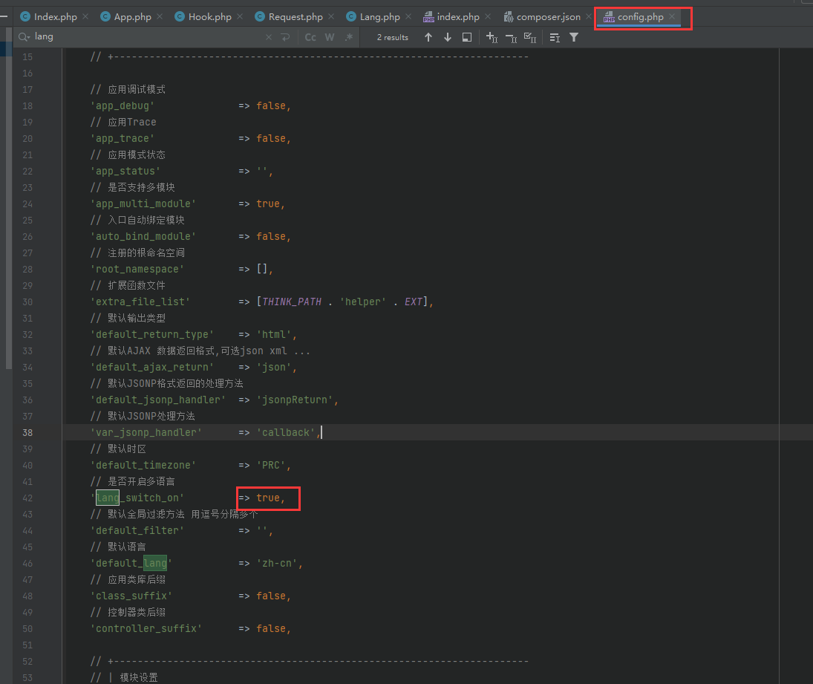


接着去查找框架中的启动入口, 我这里来到 `thinkphp/library/think/App.php` 文件的 `run`函数, 可以看到和多语言相关的代码并不多,下面图中我简单做了个标记.

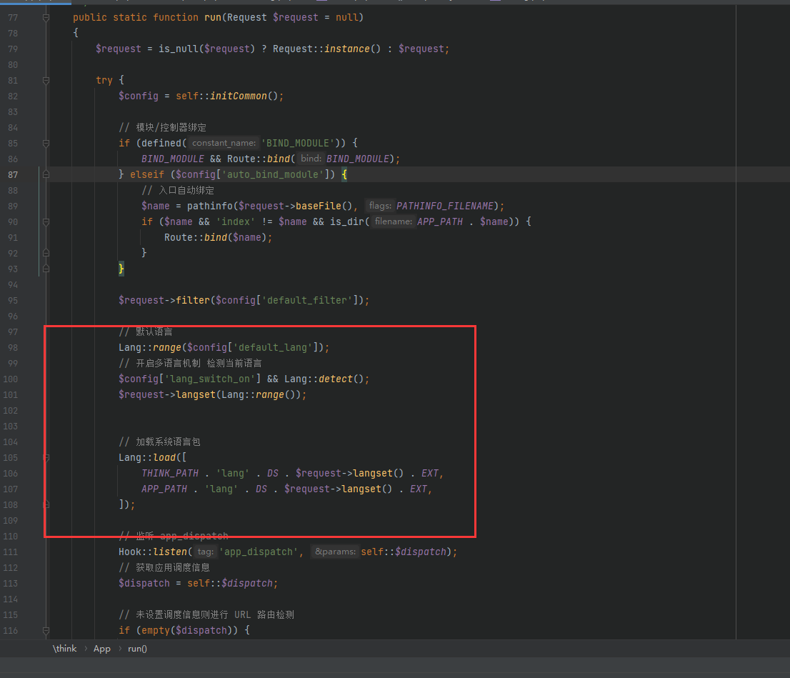

`第100行` 代码没看懂, 用了一个逻辑与, 不知道他想干什么,但是可以明确的是执行了`detect()` 函数.

开始已经将`lang_switch_on` 设置为`true` 了.这里不用管.


跟进 `detect()` 方法:

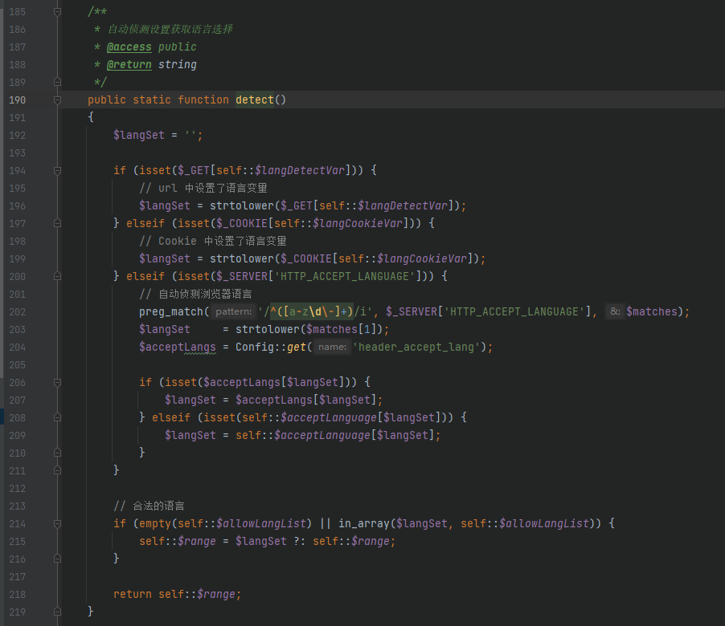

其中 `self::$langDetectVar` 是个常量

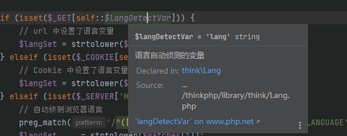

相当于如果存在 `$_GET['lang']`,就将获取到的内容变为小写,然后就结束了`if`语句.

在`214行中`由于 `self::$allowLangList` 默认为空

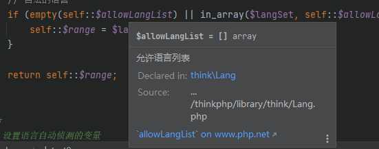

相当于直接将获取到的`$_GET['lang']`进行了赋值返回.

简单测试下:

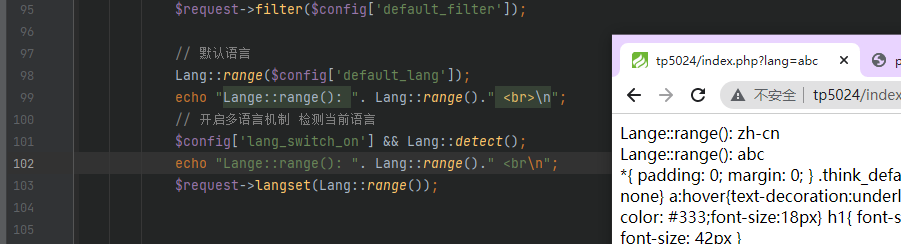

而`langset()`函数则是将加载的语言进行了设置, 设置为我们传入的`$_GET['lang']`, 可以看到截至目前为止还没有出现任何过滤.


接下来`load`函数:

```php
// 加载系统语言包
Lang::load([
    THINK_PATH . 'lang' . DS . $request->langset() . EXT,
    APP_PATH . 'lang' . DS . $request->langset() . EXT,
]);
```

我们先查看下传入数组的值:

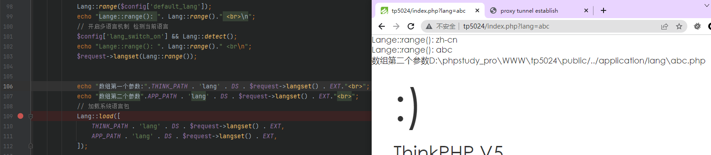

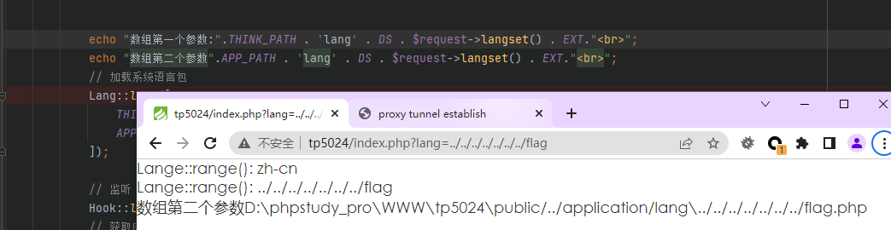

可以看到是直接将我们传入的`$_GET['lang']` 拼接到了路径中,并没有对做任何过滤.

继续跟进`load`函数:

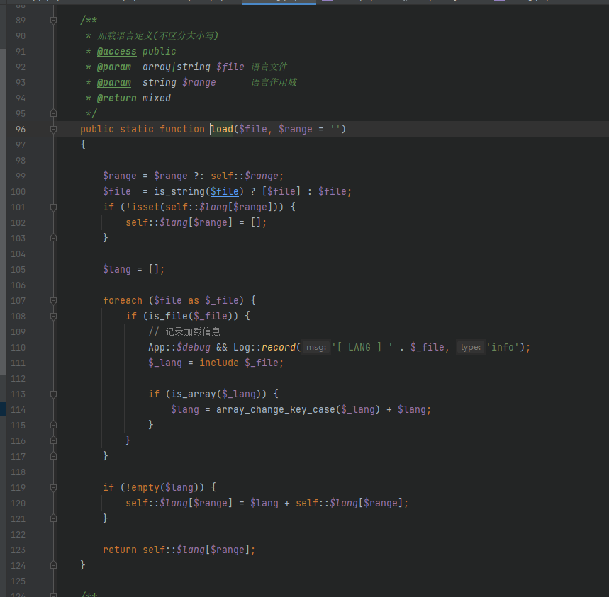

可以看到在上图代码的`第111行` 存在 `include` 函数, `include`函数的参数是我们传入的数组里面的值, 也就是上面的`D:\phpstudy_pro\WWW\tp5024\public/../application/lang\../../../../../../../flag.php`, 不过在文件包含之前,首先得判断文件存在.

我在`tp`的更目录创建了一个`flag.php` 然后尝试去包含他,通过结果可以看到, 包含成功

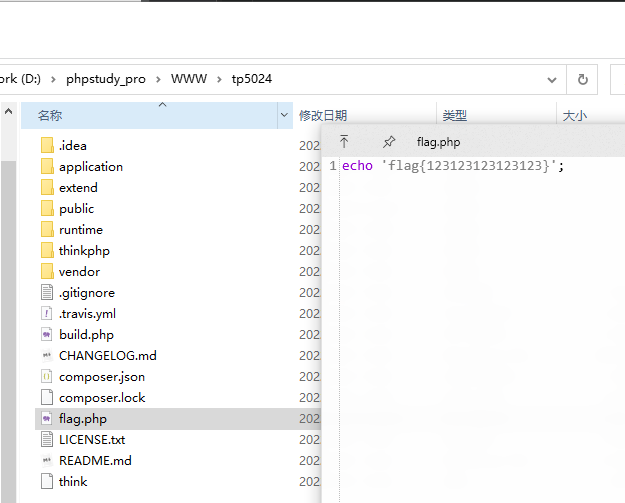

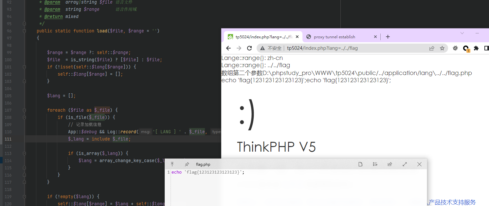

由于该文件的后缀被限制为`.php`, 并且要包含的文件还必须存在.在这两个条件的限制下,较为通用的利用方法就只有利用`pearcmd`了.


## 修复方案

我GitHub看看他[修复方案](https://github.com/top-think/framework/commit/c4acb8b4001b98a0078eda25840d33e295a7f099):

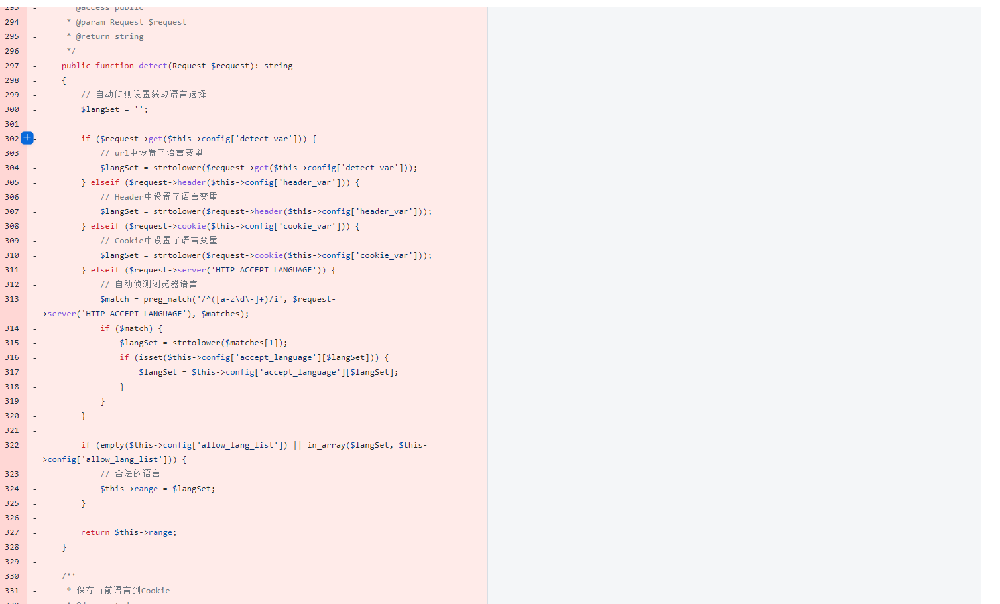

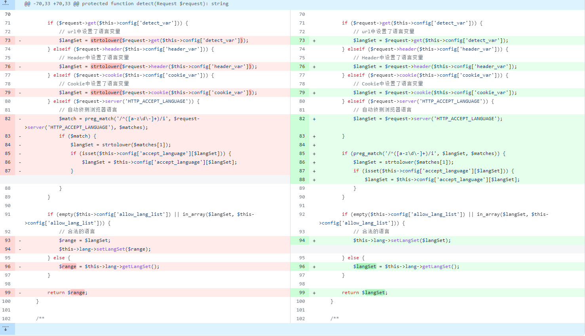

这是针对`TP6` 的一个`commit`:

修复方案就是增加了一个正则来对输入的 `$_GET['lang']`进行一个判断,正则的意思也很简单:

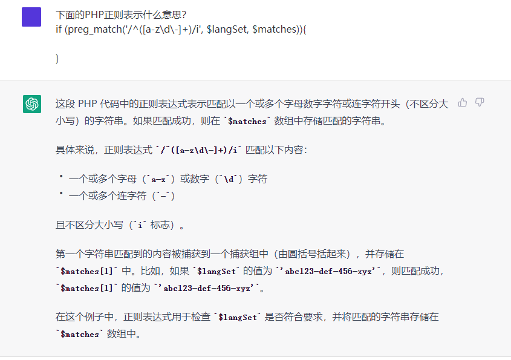


## 总结

tp的洞太多了, 还是多关注下`Issue` 把.

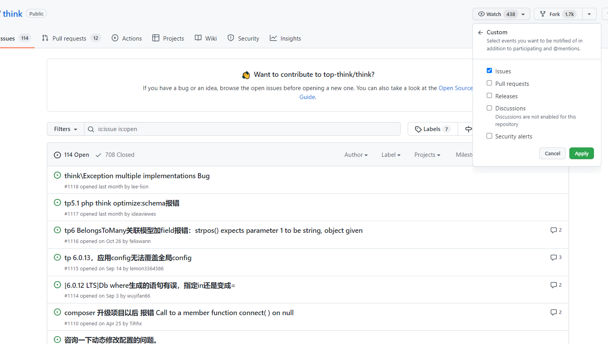

## 参考

[thinkphp_lang_RCE](https://github.com/Mr-xn/thinkphp_lang_RCE)

[Thinkphp 多语言 RCE](https://tttang.com/archive/1865)

[ThinkPHP 最新rce(QVD-2022-46174)复现和分析](https://xz.aliyun.com/t/11940)

