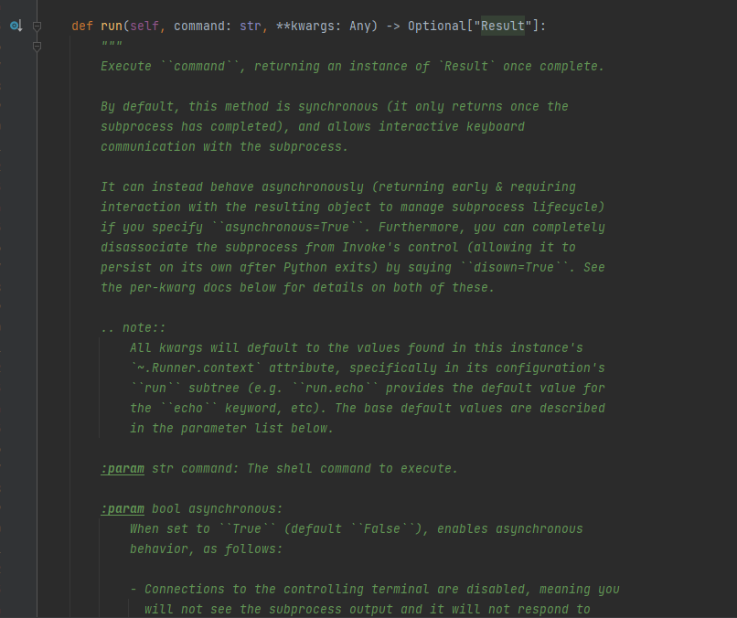
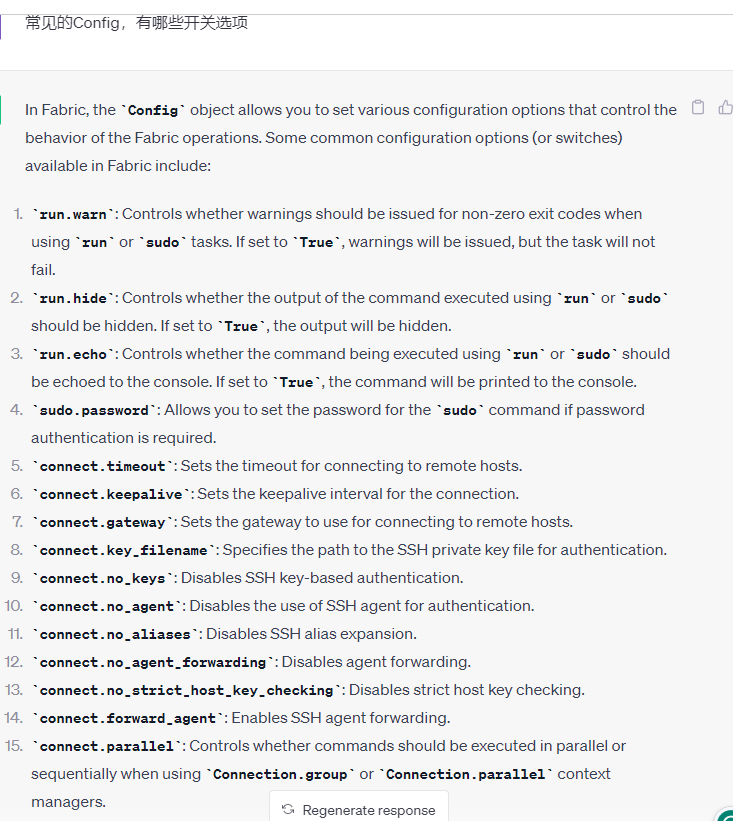
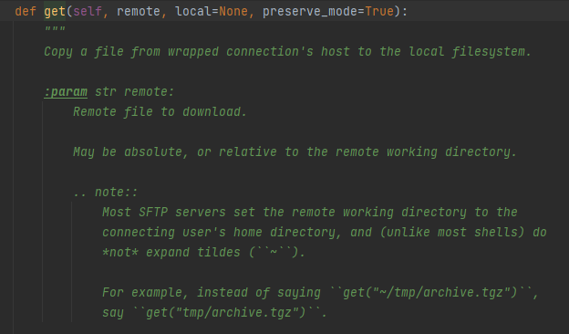

## 前言

最近在写AWD自动化的一些脚本，其中防守脚本的思路是使用 `Python` 去模拟`SSH`登录，继而去执行一系列的`Shell命令`进行最基本的防御手段, 简而言之,就是实现一个基于`SSH`的 `bot`

<!-- more -->

在`Python`中有两个库可以用来作为`SSH`客户端进行登录, 分别为: `fabric` 和 `paramiko`. 其中:

> Fabric 是一个构建在 Paramiko 之上的高级 Python 库，可简化远程计算机上 SSH 命令的执行。 Paramiko 提供了低级 SSH 客户端实现，而 Fabric 添加了一个抽象层，并为远程命令执行和任务自动化提供了附加功能。

这里我主要介绍一下 `fabric` 的 基本使用以及过程中踩过的坑.

## 正文

### `Fabric` 基本使用

当然, `fabric` 作为一个第三方库, 要想使用, 必须先得安装:

```
pip install fabric
```

**建立连接**

```python
from fabric import Connection
connection = Connection(
            host=machine[0],
            port=machine[1],
            user=machine[2],
            connect_kwargs={"password": machine[3]},
        )
```

这里需要提一下 `connection_kwargs` 这个初始化选项,  这个选项相当于使用额外的连接选项去进行`SSH`连接.你可以使用这个参数指定连接密码`(password)`, 或者链接证书 `(key_filename)`等.

> ```
> `.Connection` tries not to grow additional settings/kwargs of its
> own unless it is adding value of some kind; thus,
> ``connect_kwargs`` is currently the right place to hand in paramiko
> connection parameters such as ``pkey`` or ``key_filename``.
> ```


**运行`shell`命令**

在获取到 `connection`对象后,直接调用`run`方法就可以运行相关命令了.

```
connection.run('ls')
connection.run('pwd')
```

这些命令的回显结果是直接显示在屏幕上,如果需要捕获命令执行的结果,可以使用如下例子:

```python
result = connection.run('ls /')

# 进一步处理 结果
dic_in_root = result.strip().split('\n')
is_found_flag = any([if "flag" in dic for dic in dic_in_root])

flag = connection.run('cat /flag*').stdout
print(flag)
```

在部分场景下,我们需要在某个目录下持续性的执行某些动作, 你可以在每个命令前使用 `connetion.run(cd /xxx/xxx && your command)` 进行拼接, 但很明显这并不是一种很优雅的处理方法.

`fabic`提供了一种写法,让我们可以持续行的在某个目录下进行动作, 其写法如下:

```python
with connection.cd("/var/www/html"):
    connection.run('pwd')
    connection.run('do something')
```

##### 坑一

如果使用`run()`的执行结果为空, 或者失败,则会抛出告警并中断后续部署.E.G:

```python
shell_command = "find ./ -name \"*.php\" |xrags grep -nE \"eval\(\\\$_(POST|GET|REQUEST)\" >> backdoor.txt"
connection.run(shell_command)
```

如果 `shell_command`并没有匹配到符合正则的内容,那么程序就会抛出异常.

这个时候我们需要在`run`是设置`warn`开关, 

```python
shell_command = "find ./ -name \"*.php\" |xrags grep -nE \"eval\(\\\$_(POST|GET|REQUEST)\" >> backdoor.txt"
connection.run(shell_command, warn=True)
# 通过开启 warn 开关, 即时shell_command返回为空, 也不会中断后续部署
```

关于 `run `更多启动开关, 可以一直跟踪到源码文档里去查看.`(说实话, 个人感觉这个源码文档里面的注释表达的不是很清楚, 这个开关找了一下午才找到/哭笑)`



很明显, 如果我们要为每一个 `run`函数都配置一个 `warn`开关的话,这无疑也是一件很愚蠢的事. 我们可以在创建`Connection`对象时,添加额外的配置,E.G:

```python
from fabric import Connection, Config
connection = Connection(
            host=machine[0],
            port=machine[1],
            user=machine[2],
            connect_kwargs={"password": machine[3]},
            config=Config(overrides={
                'run': {'warn': True},  # If the shell command return code is  0, ignore the warning.
            })
        )
```

其实还有很多开关选项, 师傅们可以自己去查看文档, 这里就不在赘述了:




**上传与下载文件**

`fabric` 提供了 `put` 和`get` 方法用于上传和下载文件:

1. `put`: 用于将本地文件上传到远程
2. `get`:用于讲远程文件下载到本地

```python
# 将当前目录下的 defence.sh 上传到远程主机的 /tmp目录下
local_path = "./defence.sh"
remote_path = "/tmp/"
connection.put(local=local_path, remote=remote_path)
with connection.cd("/tmp"):
    connection.run("chmod +x defence.sh && ./defenec.sh")

    
# 将远程主机的 /tmp 目录下的 defence.sh 下载到当前目录主机的/source目录下
remote = "/tmp/defence.sh"
local_path = "/source"
connection.get(remote=remote_path, local=local_path)
```

##### 坑二:

在使用 `get()`下载远程文件到本地时, 远程文件的地址不能含有 `~/`, 比如 `~/defence.sh`.




## 参考

[Fabric 官方手册](https://fabric-chs.readthedocs.io/zh_CN/chs/tutorial.html)

[Simple Automated SSH Python Bot](https://www.youtube.com/watch?v=DYYxLSrJdW8&t=253s)