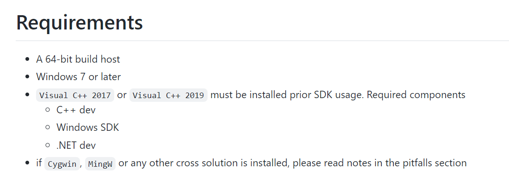

## PHP 源码编译

### 下载 php-src 源码

下载地址:

https://github.com/php/php-src

切换到指定版本,比如我这里是切换到 `7.1.0`:

```
git checkout PHP-7.1.0
```


### 下载 PHP-SDK

前往微软仓库下载 [php-sdk-binary-tools](https://github.com/Microsoft/php-sdk-binary-tools)

也可以使用 `git`进行下载:

```
git clone https://github.com/Microsoft/php-sdk-binary-tools.git php-sdk
```




> 注意: 在正式编译之前需要安装 C语言相关环境， 如下：
>
> 


不同的PHP版本需要使用不同的SDK， 官方REAMDME 中给出了相关说明：


这里根据自己编译PHP的版本选择切换到对应分支, 比如我这里是 PHP7.1 就切换到 PHP SDK 2.1

```sh
cd php-sdk
git checkout php-sdk-2.1.0
```

使用cmd执行脚本

```
phpsdk-vc15-x64.bat
phpsdk_buildtree phpmaster
```

之后切换到 php源码跟目录,执行以下命令:

切换到 PHP

```
cd /d D:\Language\Php_folder\phpsrc\php-7.1.0
```

```shell
phpsdk_deps --update --branchmaster
# 可能会报错误, 不用管


buildconf.bat

# 选择开启SAPI cli、开启debug模式、开启phar扩展；由于cli是单线程的，方便接下来的调试。然后运行configure
configure --disable-all --enable-cli --enable-debug --enable-phar

# 使用 nmake 执行build，过程中可能出现众多 warning， 不用管， 如果最后提示 build complete 则表明构建成功
nmake

构建成功后，在php源码目录中的x64/Debug_TS就生成了php.exe

```


## VScode 调试配置

### 安装 C/C++扩展


### 配置 C debug 环境

在 php源码文件夹打开 vscode

在`x64/Debug_TS/` 下创建一个 `test.php`.


配置debug 的 `launch.json`:


```json
"configurations": [
         {
            "name": "php-7.1 source code debugger",
            "type": "cppvsdbg",
            "request": "launch",
            "program": "${workspaceFolder}/x64/Debug_TS/php.exe",
            "args": ["test.php"],
            "stopAtEntry": false,
            "cwd": "${workspaceFolder}/x64/Debug_TS/",
            "environment": [],
            "console": "externalTerminal"
        }
    ]
```


到 `sapi/cli/php_cli.c`中`main`函数中下个断点:

直接回到 `test.php` 中, 按`F5`进入调试即可.

